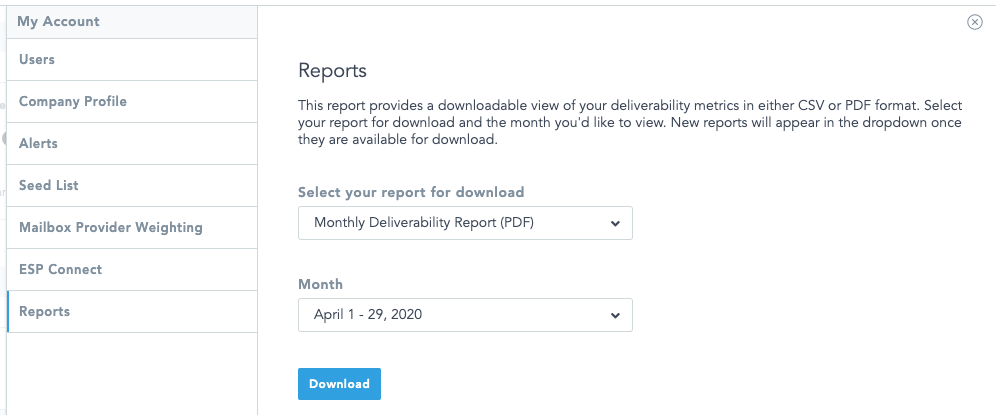
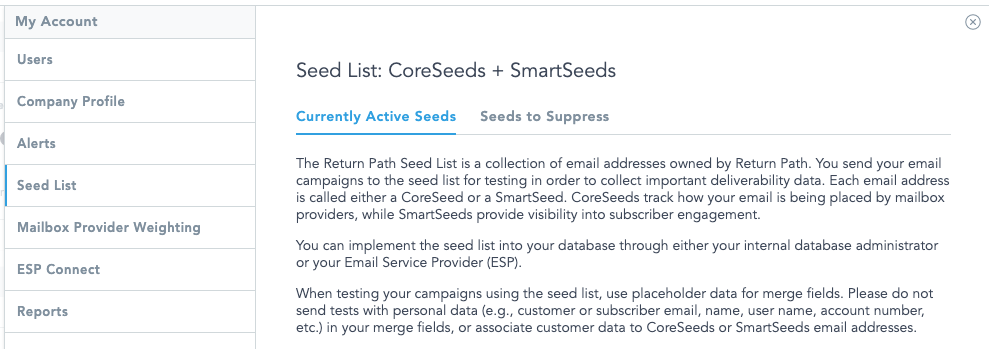
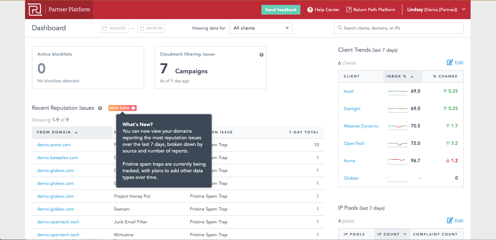

# Lindsay Thomas

_Technical writer and editor with experience in digital marketing_

----

## UI Work

Each of the thumbnails below can be opened for a larger view of the UI.
  

### Reports

Reports was a new feature for Return Path Platform, so we had to set clear expectations about how to use the feature and when new reports could be expected. The image reflects that a month-to-date report for the current month could also be downloaded. Discussions included how to render full months versus month-to-date, whether to use `.csv` and `.pdf` or `CSV` and `PDF`, and the suitability of the term `deliverability metrics`.
  

### Seed List

There were two problems to solve on this page:

- First, the Return Path Seed List gained a second data source. Instead of just standard seed addresses, we now had standard seed addresses--what became CoreSeeds--and "intelligent" seed addresses, or what we called SmartSeeds. On this page, we needed to reflect the change and explain the difference between the two data sources.  

- Second, we implemented statements across Return Path Platform to ask users not to upload personally identifiable information (PII) to the platform. Many email marketers find it useful to associate certain types of "personal" data to seed addresses in order to test merge fields for personalization, such as first and last name, account number, username, and so on. We simply asked that customers use placeholder data rather than data from real people.
  

### Partner Platform Dashboard

When the Partner Platform product team added a new table, Recent Reputation Issues, we used Pendo to add a badge and tooltip drawing attention to the enhancement. Recent Reputation Issues started with tracking a single metric, so we needed to set expectations for the user and assure them more metrics were coming. Discussions included `last 7 days` versus `past 7 days`.
